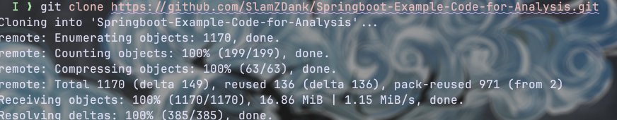

# Spring Boot E-Commerce - Code Analysis

A sample Spring Boot e-commerce application used to demonstrate static code analysis, identify technical debt, and highlight violations of SOLID design principles.

## Setup & Installation

**1. Clone & Init**
Get the code and explore the base structure.

**2. Environment**
Requires Java, Maven, and MySQL. Import `basedata.sql` to set up the database.

**3. Tooling**
We use SonarQube for static analysis. Install the package to get started.

---

## Code Analysis Workflow

The project uses automated quality gates to track technical debt and code smells.

**1. Run the Scan**
Execute the SonarQube scanner against the codebase.

**2. Review Dashboard**
Check the results for vulnerabilities and code smells.

**3. Cloud Integration**
Results are pushed to SonarQube Cloud for centralized reporting.

---

## SOLID Principles & Code Smells

Based on the SonarQube audit (`code_smells.csv`), here is how the identified technical debt maps to SOLID principle violations:

| Principle | Rules Triggered | What went wrong in the code? |
| :--- | :--- | :--- |
| **SRP** (Single Responsibility) | S120, S101, S117, S7930 | **Naming Chaos & God Classes**: DAOs, Services, and Controllers lack structural discipline. Mixed UI responsibilities (e.g., duplicate DOM IDs in JSPs). |
| **OCP** (Open/Closed) | S1192, S7926 | **Hardcoded Literals**: Auth routes (`"/login"`) and UI viewports are hardcoded. Changing behavior requires modifying existing files instead of extending them. |
| **LSP** (Liskov Substitution) | S6819 | **Broken Semantics**: Improper use of ARIA roles instead of standard HTML5 elements (e.g., using `role="dialog"` instead of `<dialog>`), breaking expected document behavior. |
| **ISP** (Interface Segregation) | S1186, S5254, ImgAlt | **Dead Code**: Empty methods in `Cart.java` and test files, plus missing mandatory HTML attributes (`alt`, `lang`), showing classes/views are forced to implement things they don't use. |
| **DIP** (Dependency Inversion) | S116 | **Leaky Abstractions**: Public fields in `HibernateConfiguration.java` expose internal database credentials directly to higher-level modules. |

---

## Project Structure
- `src/main/java/.../controller`: HTTP routing (Heavy SRP/OCP violations).
- `src/main/java/.../dao`: Data Access layer.
- `src/main/webapp/views`: JSP frontend (Heavy LSP/ISP violations).
- `code-smella/`: Raw SonarQube CSV exports.
